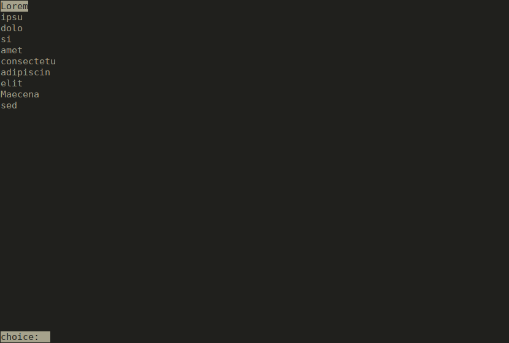
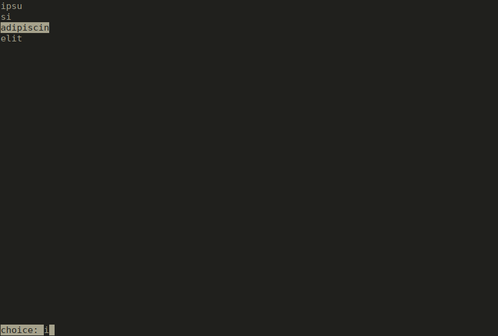

# cmenu

This is a very basic 'menu' application.

It works a bit like 'dmenu' from suckless.org but cmenu runs in a terminal with
a very basic ncurses interface.

To compile:
```
g++ -lncurses -std=c++11 cmenu.cpp -o cmenu
```

Usage:
cmenu takes at least two parameters: --in and --out
both are of the form --in FILE
the --in file is basically the input of the menu, that is every line of the file will be an
entry in the menu selectable by the user. Just like with dmenu the user can type to search,
navigate with the arrow keys and use page up and page down. Both Ctrl+X and the escape key cancel
and return the empty string.

Ctrl+W will delete the last word typed like it would in bash.

Pressing return will exit the program and either the selected item in the list or the typed text
will be written to the out file.

Options

--in File   sets the input file (mandatory)
--out File  sets the output file (mandatory)
--ci        if used than the search will be case insensitive (default is case sensitive)
--prompt    sets the prompt at the bottom (default is "choice: ")

Both input and output file can be named pipes.

(Note that lines that longer than the terminal width will be cut off.)

Example:
```
cmenu --in in --out out
```

With the file out containing:
```
Lorem
ipsu
dolo
si
amet
consectetu
adipiscin
elit
Maecena
sed
```

Will show the following in the terminal



If we type the letter `i` and then twice the key `down` we get:



If we press enter the file `out` will containt the string `adipiscin` if we instead
chose to type Ctrl-X (or escape) the `out` file will be empty.
